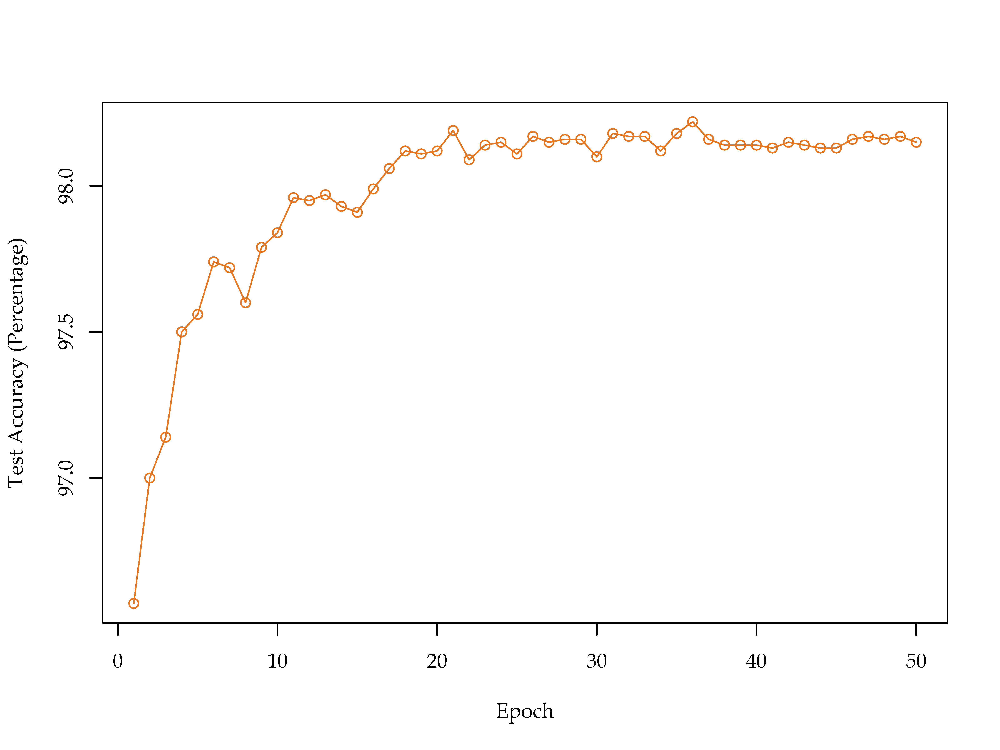

## Description
A single-layer neural network for the MNIST dataset, trained with stochastic gradient descent. Back-propagation is implemented basically from scratch to demonstrate how it works.

MNIST dataset is obtained via [Chainer](http://chainer.org/).

## Result
The model was trained for 50 epochs, with learning rate of 0.01 and 100 hidden units. Best test accuracy achieved is around 98.22%.

## Author
Francis Hsu, University of Illinois at Urbana–Champaign.
