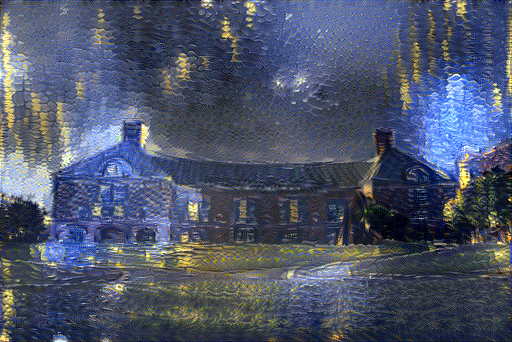

## Description
A [Chainer](http://chainer.org/) implementation of *A Neural Algorithm of Artistic Style*. In short, this is an algorithm that transfers the artistic style of one image onto another with the help from a convolutional neural network.

## Detail
### Requirement
Code tested with Chainer v1.14.0 and v1.18.0.

A VGG-19 Caffe model is required for this implementation  to work. You can use the normalized version used by the authors of the article: [`vgg_normalised.caffemodel`](http://bethgelab.org/deeptextures/), or use the original one made by VGG team: [`VGG_ILSVRC_19_layers.caffemodel`](https://gist.github.com/ksimonyan/3785162f95cd2d5fee77#file-readme-md).

With minor modifications, other CNNs (e.g. NIN, GoogLeNet) can be used as well. See [jcjohnson's explanation](https://github.com/jcjohnson/neural-style) and [mattya's implementation](https://github.com/mattya/chainer-gogh/blob/master/models.py).

### Usage
under construction ᕕ( ᐛ )ᕗ

### Parameters
A helper function `generate_image()` was created to help the transfer. The parameters it uses are:
* `cnn`: A CNN model object. Currently only VGG19 is implemented.
* `content`, `style`: Strings. Filenames for the content and style images to use.
* `alpha`, `beta`: Floats. Weighting factors for content and style reconstruction, respectively.
* `color`: String. Scheme of color preserving to use, choose between `none` (no color preserving), `historgram` (for histogram matching), and `luminance` (for luminance-only transfer).
 * `a`: Boolean. Whether to match the luminance channel of the style image to the content image before transfering, only work if `color` is `luminance` of course.
* `init_image`: String. Choose between `noise`, `content`, and `style`. 
* `optimizer`: String. Optimizer to use, you can choose between `adam` (for ADAM) and `rmsprop` for (Alex Graves’s RMSprop).
 * `iteration`: Int, number of iterations to run.
 * `lr`: Float. Learning rate of the optimizer.
 * `save`: Int. The optimizer will write an output to file after every `save` iterations.
 * `filename`: String. Prefix of filename when saving output. The saved files will have name in format `prefix_iterations`.
* `contrast`: Boolean. Sometimes the output has less saturation than expected, so I insert few lines to give the contrast a kick when saving to file.

## Result
under construction ᕕ( ᐛ )ᕗ

|||
|:-------------------------:|:-------------------------:|
| | |
| | |
| | |
| | |

### Color Preserving Transfer
under construction ᕕ( ᐛ )ᕗ
||||
|:-------------------------:|:-------------------------:|:-------------------------:|
||||

## Reference
Leon A. Gatys, S. Ecker & Matthias Bethge (2015). [*A Neural Algorithm of Artistic Style*](http://arxiv.org/abs/1508.06576). In: *CoRR*.

Leon A. Gatys, Matthias Bethge, Aaron Hertzmann & Eli Shechtman (2016). [*Preserving Color in Neural Artistic Style Transfer*](http://arxiv.org/abs/1606.05897). In: *CoRR*.

Leon A. Gatys, Alexander S. Ecker, Matthias Bethge, Aaron Hertzmann & Eli Shechtman (2016). [*Controlling Perceptual Factors in Neural Style Transfer*](http://arxiv.org/abs/1611.07865). In: *CoRR*.

Gatys, Leon A., Ecker, Alexander S. & Bethge, Matthias (2016). [*Image Style Transfer Using Convolutional Neural Networks*](http://www.cv-foundation.org/openaccess/content_cvpr_2016/html/Gatys_Image_Style_Transfer_CVPR_2016_paper.html). In: *The IEEE Conference on Computer Vision and Pattern Recognition*, pp. 2414-2423.

## Acknowledgement
In making this program, I referred to helpful works of [jcjohnson](https://github.com/jcjohnson/neural-style), [apple2373](https://github.com/apple2373/chainer_stylenet), [mattya](https://github.com/mattya/chainer-gogh), and [andersbll](https://github.com/andersbll/neural_artistic_style).
 
## Author
Francis Hsu, University of Illinois at Urbana–Champaign.
